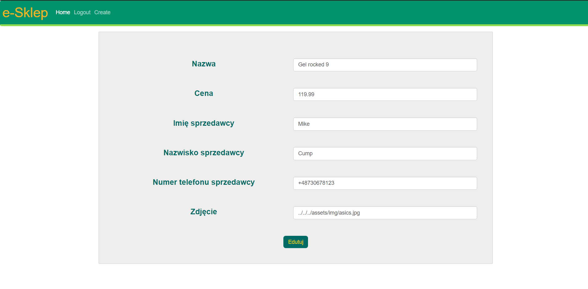

## e-Sklep application
### Tworzenie applicacji zawiera trzy krok:
- Krok 1. Tworzenie Bazy Firebase.
- Krok 2. Tworzenie Strony w Angularze.
- Krok 3. Polączenie komunikaci bazy ze stroną. 

### Krok 1.
**a)** Napierw została stworzona baza Firebase zawierająca naszych użytkowników oraz liste produktów, którę  w przyszlości będą przez naszą bazę udostepniąne.  

- Tabela Users 


- Tabela Items


### Krok 2. Została stworzona stroną zawięrająca potrzebną dla naszych potrzeb funkcji.
### Funkcjonalność aplikacji 
* Widok glówny - wszystkie propozycje 
* Logowanie 
* Rejestracja
* Dodawanie/Edycja oferty 
* Kupowanie productu


### Widok głowny
**a)** Oferty 
* nazwa  
* zdjęcie   
* cena  
* możliwość przejścia do szególów  
**b)** Filtrowanie (nazwa/cena/)  
**c)** Przejścia do szczególów  
**d)** Menu   

  

Szczegóły oferty  
**a)** Kupowanie productu  
**b)** Nazwa  
**c)** Zdjęcie  
**d)** Sprzedawca  
**e)** Cena  
**f)** Opis  
**g)** Menu  


Dodanie/Edycja oferty  
**a)** Menu  
**b)** Nazwa  
**c)** Zdjęcie  
**d)** Sprzedawca(automatycznie)  
**e)** Cena  
**f)** Opis  



### Krok 3.
**a)** Dla komunikacji z bazą została stworzona klasa **ItemService** oraz poszczególne funkcje:
 
```ts
@Injectable({
  providedIn: 'root'
})
export class ItemService implements OnInit {

  private dbPath = '/Items';
  itemsRef: AngularFirestoreCollection<Item> = null;
  private items: Item[];

  ngOnInit(): void {
    this.updateItems();
  }

  constructor(private db: AngularFirestore) {
    this.itemsRef = db.collection(this.dbPath);
    this.updateItems();
  }
  ...
```
- **generateId()** -  z pomocą tej funkcji możemy generować unikalny numer dla każdego kolejnego itemu. Funkcja zwraca maksymalny numer id + 1  
```ts
  public generateId(): number {
    var maxId = 0;
    if (this.items != null) {
      for (let c of this.items) {
        if (c.id > maxId) maxId = c.id;
      }
    }
    return maxId + 1;
  }
  ...
```
- **getItemsRef ()** i **getItems()** - zwraca odpowiegnio listę produktów z bazy danych oraz listę którą zawieraza objekty typu Item   
```ts
  getItemsRef(): AngularFirestoreCollection<Item> {
    return this.itemsRef;
  }

  public getItems() {
    return this.items;
  }
  ...
```
- **updateItems()** -  ta funkcja przypisuje listę produktów z bazy Firebase do listy która zawiera struktury item  
```ts
private updateItems() {
    this.getItemsRef().snapshotChanges().pipe(
      map(changes =>
        changes.map(c =>
          ({ key: c.payload.doc.id, ...c.payload.doc.data() })
        )
      )
    ).subscribe(products => {
      this.items = products;
    });
  }
  ...
```

- **getItem()**, **updateItem()**, **addItem()**, **deleteItem()** - odpowiadają za zwracanie, modyfikowanie, dodawania oraz usuwanie elentów z listy.
```ts
  getItem(id: number): Observable<Item> {
    this.updateItems();
    return of(this.items.find(item => item.id == id));
  }

  updateItem(course: Item) {
    this.itemsRef.doc(course.id + "").set({ ...course });
  }

  addItem(item: Item): void {
    this.itemsRef.doc(item.id + "").set({ ...item });
  }

  deleteItem(id: number) {
    this.db.collection('Items').doc(id.toString()).delete();
  }
}
```

**b)** Stworzona klasa dla autetyfikacji userów 

