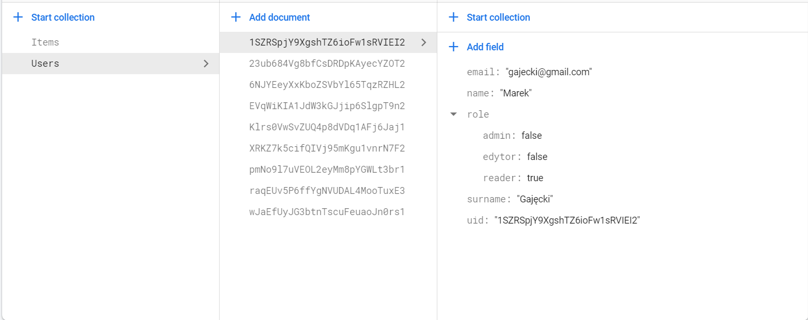
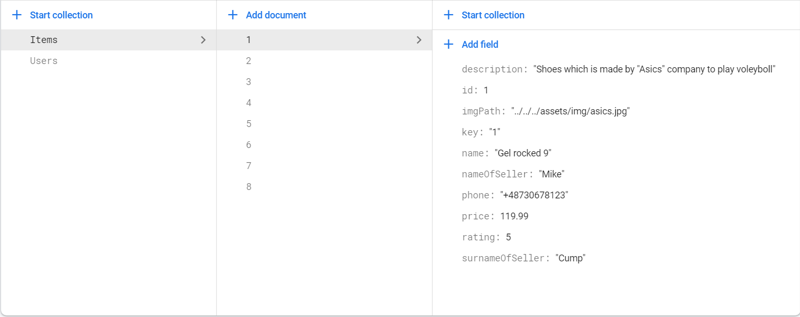
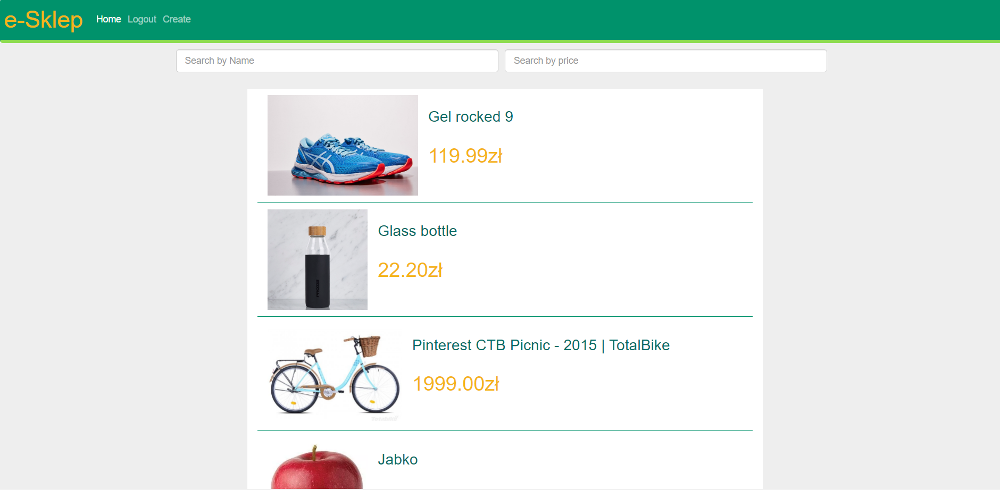
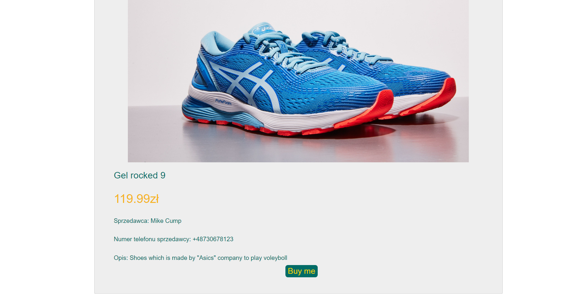

## e-Sklep application
### Tworzenie applicacji zawiera trzy krok:
- Krok 1. Tworzenie Bazy Firebase.
- Krok 2. Tworzenie Strony w Angularze.
- Krok 3. Polączenie komunikaci bazy ze stroną. 

### Krok 1.
**a)** Napierw została stworzona baza Firebase zawierająca naszych użytkowników oraz liste produktów, którę  w przyszlości będą przez naszą bazę udostepniąne.  

- Tabela Users 

- Tabela Items

### Krok 2. Została stworzona stroną zawięrająca potrzebną dla naszych potrzeb funkcji.
### Funkcjonalność aplikacji 
* Widok glówny - wszystkie propozycje 
* Logowanie 
* Rejestracja
* Dodawanie/Edycja oferty 
* Kupowanie productu

### Widok głowny
a) Oferty  
* nazwa  
* zdjęcie  
* cena  
* możliwość przejścia do szególów   
b) Filtrowanie (nazwa/cena/)  
c) Przejścia do szczególów  
d) Menu  
  

Szczegóły oferty  
a) Kupowanie productu   
b) Nazwa  
c) Zdjęcie   
d) Sprzedawca   
e) Cena   
f) Opis  
g) Menu  

### Krok 3.
**a)**
